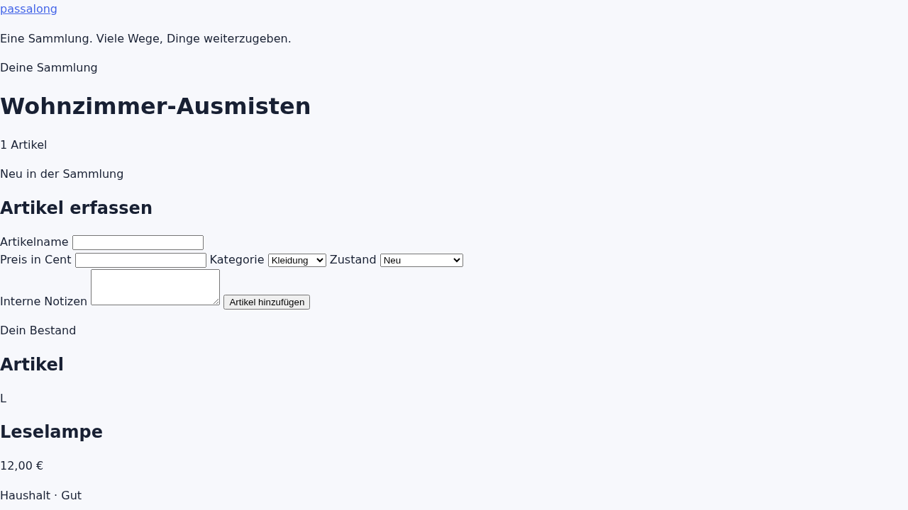

# passalong

[](LICENSE)
[](https://github.com/tilloh-org/passalong/actions/workflows/ci.yml)
[](https://github.com/tilloh-org/passalong/releases)

> Manage the things you no longer need — and give them a second home.

passalong is a self-hosted, open-source app for **families and private sellers**
to manage a collection of second-hand items they want to sell or give away.
Catalog your stuff once (photos, price, condition, category), track where each
item is listed and whether it has been sold — across flea markets, online
marketplaces, or a simple hand-over to friends.

`One man's trash, that's another man's come up` - Macklemore, Thrift Shop

**One collection. Many ways to pass it along.**

## Features

- **Item collection** — photos (gallery + cover image), price, category,
  condition, internal notes
- **Sale channels** — track per item where it is listed (market day, online
  marketplace, shop, …) and its sale status
- **Market day mode** — QR-code price tags, scan-to-sell, daily settlement,
  stand fees (net calculation), expense tracking
- **Public stand page** — a shareable, login-free page for buyers, with item
  filter, wishlist and a map pin so buyers can find the booth
- **Statistics & history** — earnings, per-category charts, filterable sales
  history
- **Multi-user** — profiles, avatars, per-family-member collections (multi-tenant:
  one instance can serve family & friends)
- **i18n** — German and English from day one

## Technology

- [SvelteKit](https://kit.svelte.dev) (TypeScript) — one project for UI, server
  routes and API
- SQLite — a single file database, no external service
- Docker & docker-compose — one command to run it
- Built to stay **lightweight and close to web standards**

## Quick start (Docker)

```bash
git clone https://github.com/tilloh-org/passalong.git
cd passalong
docker compose up -d --build
# open http://localhost:4242
```

For unattended first installation, set the optional single-line
`PASSALONG_BOOTSTRAP` value in `.env` before starting the container:

```dotenv
PASSALONG_BOOTSTRAP={"accounts":[{"tenantName":"Example household","username":"admin","displayName":"Example admin","password":"replace-with-a-unique-password","instanceAdmin":true}]}
```

The value is a JSON object with an `accounts` array. Every account creates its
own tenant in v1.0.0. On an empty database, exactly one account must set
`instanceAdmin` to `true`. Provisioning runs after migrations and before the
HTTP server accepts regular requests. It is atomic and create-only: later
starts neither update nor delete existing tenants, accounts, passwords, or
roles. An existing username must match the configured tenant, display name,
instance-admin flag, and password, otherwise startup stops without writes.

Without a bootstrap manifest, or whenever the global account count is zero,
passalong offers open first registration. The first successfully created
account receives the instance-admin role. The password is stored as a salted
scrypt hash; the browser receives a 30-day, HttpOnly session cookie while only
its hash is stored in SQLite. Later visits show the login form. Without an
active session, a known collection URL cannot reveal collection data or
internal notes.

Builds the image locally from the Dockerfile. Once the first release is
published, a prebuilt image is available from GitHub Container Registry
(`ghcr.io/tilloh-org/passalong:latest`) — then `docker compose up -d` is enough.

Persistent data (SQLite database, uploads) lives in the named volume
`passalong-data` (`/data` inside the container). When serving the app behind a
reverse proxy, set `PASSALONG_ORIGIN` to its public origin so SvelteKit can keep
its cross-site form protection enabled.

## Development

```bash
pnpm install
pnpm dev
```

See [CONTRIBUTING.md](CONTRIBUTING.md) for details.

## Screenshots



## Documentation

- [SECURITY.md](SECURITY.md) — reporting vulnerabilities & hardening
- [CONTRIBUTING.md](CONTRIBUTING.md) — how to contribute

## Roadmap

- [-] v0.1 — core collection: SQLite collection/item model, price, category,
  condition and internal notes are implemented; photo gallery and user sessions follow
- [ ] v0.2 — channel & sale status, public stand view
- [ ] v0.3 — market day mode (price tags, scan, settlement)
- [ ] Backups, statistics, advanced i18n
- See [CHANGELOG.md](CHANGELOG.md)

## License

[MIT](LICENSE)
